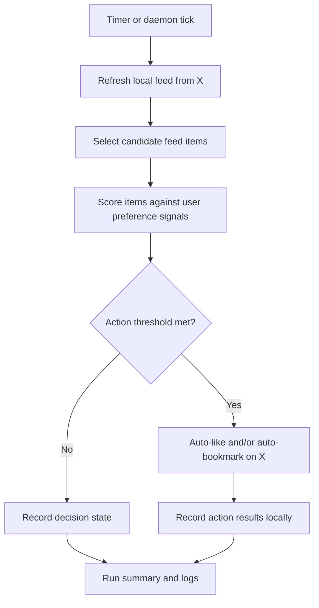

# X Feed

## Problem Frame

The repo already has the foundations for a local-first X workflow: it can sync Home timeline tweets into a local feed archive, browse them from the CLI, search across feed + likes + bookmarks, and perform some remote write actions against X. That is useful, but it still leaves the user doing the expensive part manually: repeatedly checking the feed and deciding what is worth liking or bookmarking.

The next step is to turn the feed feature into an autonomous agent loop. The tool should periodically refresh feed data, evaluate items using the user's historical likes and bookmarks as preference signals, and automatically like or bookmark tweets that fit those preferences. This is explicitly not a "suggestion inbox" product. The user wants direct automation.

## Requirements

**Foundation**
- R1. The product must preserve the current local-first feed archive model rather than replacing it with a hosted or cloud-dependent workflow.
- R2. The product must continue reusing the current logged-in X browser session model for feed access and remote actions.
- R3. The product must preserve stable feed item identity so later evaluations and actions refer to the same local item over time.
- R4. Existing feed browsing and cross-archive search must remain available; autonomous actions extend the product rather than replacing the current read/search surfaces.

**Autonomous Agent Loop**
- R5. The product must support a recurring autonomous workflow that refreshes feed data and evaluates items without manual prompting.
- R6. The first release must support scheduled execution.
- R7. The design must preserve a later always-on daemon mode, and planning should treat scheduled execution as the first delivery and daemon mode as a direct extension rather than a separate product.
- R8. The autonomous workflow must be allowed to perform remote `like` and `bookmark` actions without per-item human confirmation.
- R9. The autonomous workflow must be able to apply either action independently, so an item may receive only a like, only a bookmark, both, or neither.
- R10. The agent must evaluate feed items using the user's historical likes and bookmarks as the primary preference signals.
- R11. The first release should optimize for a balanced operating point: better coverage than a conservative mode, while still trying to avoid obvious over-action.
- R12. The first release must rely on learned preference judgment rather than a user-authored rules engine.

**Evaluation Scope**
- R13. The agent must be allowed to evaluate any locally stored feed item, not only the newest fetch batch.
- R14. The agent must support repeated re-evaluation of the same feed item over time as the preference model, corpus, or action state changes.
- R15. A successful action must be treated as idempotent per action type: once an item has been successfully auto-liked, the system must not attempt to auto-like it again; once it has been successfully auto-bookmarked, the system must not attempt to auto-bookmark it again.
- R16. Re-evaluation may still lead to an additional missing action later. For example, an item that was previously auto-liked but not bookmarked may later be auto-bookmarked.
- R17. The first release does not need to auto-undo past actions. Once an automatic like or bookmark succeeds, reversal is out of scope for this phase.

**Decision Quality and Controls**
- R18. The first release must not require blacklists, whitelists, language filters, minimum-engagement filters, or similar explicit hard constraints.
- R19. The system should still leave room for later operator constraints if the first release proves too noisy, but those controls are not required to define or ship the first version.
- R20. The first release must favor preference-driven action decisions over topic-only relevance. Topic relevance may help candidate retrieval, but action decisions are fundamentally about whether the user would want to like or bookmark the item.

**Observability**
- R21. The product must keep a durable local record of autonomous runs and the actions taken or skipped during those runs.
- R22. The user must be able to inspect what the agent did after the fact without needing to watch it live.
- R23. The default experience should not require interruptive confirmation or per-run chatty prompts, but failures and action history must remain inspectable.

## Success Criteria

- The user can enable an automated workflow that periodically refreshes feed items and performs autonomous likes and bookmarks without staying in the loop for each decision.
- The automated workflow produces actions that feel directionally aligned with the user's historical taste, with acceptable mistakes at a balanced precision/recall tradeoff.
- The user can review what the agent did after the fact from local logs or summaries.
- The product model remains coherent: feed sync, search, and browsing still work, and autonomous actions build on the same local archive instead of creating a disconnected subsystem.
- Planning can proceed without inventing the core product behavior for scheduling, repeated evaluation, action semantics, or first-release control surface.

## Scope Boundaries

- The first release does not need a human confirmation queue, approval inbox, or review step before each action.
- The first release does not need a user-authored policy/rules language.
- The first release does not need to auto-undo likes or bookmarks that were already applied.
- The first release does not need a hosted service, remote dashboard, or multi-device coordination model.
- This brainstorm does not lock in the exact scoring algorithm, mutation query ids, storage schema, scheduler implementation, or CLI command shape.

## Key Decisions

- Full automation, not suggestion mode: the user wants the system to act, not merely rank candidates for manual approval.
- Both actions are in scope: the first release should be able to auto-like and auto-bookmark rather than forcing one weaker action path.
- Balanced operating point: the user prefers a middle ground that tolerates some mistakes for materially better coverage.
- Scheduled first, daemon-compatible later: scheduled execution is the minimum useful shape, but the product should not paint itself into a corner that blocks an always-on mode.
- Re-evaluate broadly: the agent may revisit any local feed item over time instead of being restricted to only the newest fetch batch.
- Idempotent per action type: repeated evaluation is allowed, but already-successful likes/bookmarks must not be replayed.
- No rules engine in v1: the first release should prove the preference-learning loop before adding explicit constraint systems.
- Quiet by default, inspectable after the fact: autonomous operation should not depend on real-time supervision, but it must leave a durable trail.

## Dependencies / Assumptions

- Verified assumption: the repo already supports local feed sync and feed archive status via `src/graphql-feed.ts`, `src/feed.ts`, `src/feed-db.ts`, and `src/cli.ts`.
- Verified assumption: the repo already supports cross-archive retrieval and an action-oriented ranking mode via `src/hybrid-search.ts` and `src/cli.ts`.
- Verified assumption: the repo already supports remote destructive write actions for `unlike` and `unbookmark` in `src/graphql-actions.ts`.
- Verified assumption: the repo does not currently expose positive remote `like` or `bookmark` mutation helpers in `src/graphql-actions.ts`.
- Verified assumption: the repo does not currently expose a scheduler, daemon loop, or background worker surface in `src/cli.ts` or other scanned source files.
- Unverified assumption: X still exposes positive `like` and `bookmark` web mutations that can be driven through the same browser-session-backed request model.

## Outstanding Questions

### Resolve Before Planning
- None. The user has already chosen the product behavior needed to plan the first version.

### Deferred to Planning
- [Affects R6][Technical] What is the smallest operator surface for scheduled execution: one-shot command plus external cron, an internal `--every` loop, or both?
- [Affects R7][Technical] How should scheduled mode and later daemon mode share one execution model without duplicating action logic?
- [Affects R8][Needs research] What are the current X web mutation contracts for positive `like` and `bookmark` actions?
- [Affects R10][Technical] What preference signal stack is strong enough for balanced autonomous actioning in v1: historical co-occurrence, author/domain priors, hybrid search scores, LLM judgment, or a staged combination?
- [Affects R15][Technical] What local state model should track per-item evaluation history and per-action success so repeated evaluation stays safe and idempotent?
- [Affects R21][Technical] What is the minimal durable run/action log that makes autonomous behavior inspectable without introducing a heavyweight job system?

## Next Steps
→ `/prompts:ce-plan` for structured implementation planning
