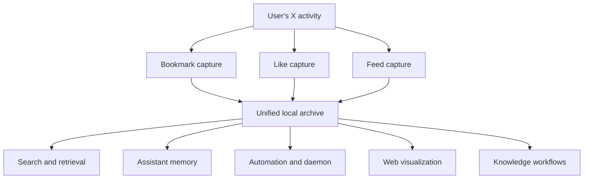

# X Assistant Unified Archive

## Problem Frame

This fork is no longer a thin continuation of the original bookmark-and-wiki tool. It already contains three local archive families, a feed agent, a daemon, semantic retrieval, and a web dashboard. The current product direction is a personal X assistant plus knowledge base, not a bookmark-only sync tool.

The problem is that the product direction and the technical base are misaligned. `bookmark`, `likes`, and `feed` store near-identical tweet-shaped records, but they still use separate ingestion flows, separate indexes, partially separate APIs, and inconsistent CLI contracts. That duplication raises carrying cost, slows new feature work, and keeps the older bookmark lineage disproportionately influential on the architecture.

The goal is to gradually replace the old center of gravity with a unified archive model where bookmarks, likes, and feed entries are three acquisition modes over one shared local data foundation.

## Requirements

**Product Direction**
- R1. The repository must explicitly treat this fork as an independent product whose primary identity is a personal X assistant plus knowledge base, not a compatibility continuation of the original bookmark-first tool.
- R2. Ongoing upstream observation must be treated as selective design intake only. The project must not require periodic synchronization with `afar1/fieldtheory-cli` as part of normal roadmap execution.
- R3. Future archive-facing features must be evaluated first against the unified archive direction rather than against original-repo command or schema precedent.

**Unified Archive Model**
- R4. The system must converge toward one shared local archive model for tweet-like items collected from bookmarks, likes, and feed.
- R5. The unified model must preserve source-specific facts rather than flatten them away. At minimum, it must continue to represent whether an item came from bookmarks, likes, feed, or multiple sources, and keep source-specific timestamps or ordering metadata when those distinctions matter.
- R6. Shared item content must be normalized once and reused across search, web, semantic retrieval, assistant context, and downstream automation flows.
- R7. The architecture must support items accumulating multiple source relationships over time without duplicating the core tweet content as separate archive records.

**Product Surfaces**
- R8. CLI, web, and agent-facing surfaces must gradually converge on a consistent archive contract, while preserving enough compatibility that existing local workflows do not break abruptly.
- R9. Search and browsing experiences must be able to operate over the unified archive while still supporting source-scoped views such as bookmarks-only, likes-only, and feed-only.
- R10. Feed automation, preferences, metrics, and daemon observability must remain first-class product capabilities throughout the migration rather than being treated as temporary experiments.
- R11. Knowledge workflows such as export, summary, retrieval, and future synthesis features must be able to build on the same unified archive foundation instead of depending on bookmark-only plumbing.

**Migration and Risk Control**
- R12. The transition must be incremental. The project must avoid a flag day rewrite that requires replacing all bookmark, likes, and feed code paths at once.
- R13. Each migration phase must leave the repository in a shippable state with clear runtime ownership boundaries between legacy modules and unified modules.
- R14. The migration must preserve existing local user data or provide an explicit, low-risk rebuild path from existing caches if a direct migration is not worth the complexity.
- R15. The plan must identify which original-repo-derived areas are candidates for long-term freeze, compatibility wrappers, or eventual removal.

## Success Criteria
- New roadmap work can be described in terms of one archive foundation instead of three partially parallel systems.
- Shared capabilities such as search, semantic indexing, web views, and assistant memory stop requiring per-source duplication.
- Feed-driven assistant workflows remain stable or improve during the migration.
- Bookmark and likes capabilities continue to work during phased adoption, without requiring ongoing upstream synchronization.
- The team has a clear policy for upstream intake: observe, evaluate, selectively absorb, but do not merge by default.

## Scope Boundaries
- This effort does not require preserving full architectural compatibility with the original repository.
- This effort does not require an immediate rewrite of every bookmark-only or wiki-only command.
- This effort does not require deciding every future assistant feature up front.
- This effort does not commit the project to a remote service or cloud backend; the local-first model remains in scope.

## Key Decisions
- Unified archive is the target center of gravity: this best matches the current product trajectory and minimizes future duplication.
- Upstream becomes a design reference, not a merge target: the fork has already diverged in product intent and architecture.
- Migration should be phased, not revolutionary: the current repo already has meaningful working surfaces that should stay usable while the base is consolidated.
- Feed remains strategically central: it is the strongest expression of the assistant product direction and should shape the target architecture more than legacy bookmark workflows do.

## Dependencies / Assumptions
- Existing local caches for bookmarks, likes, and feed are sufficient raw material for a phased unification strategy.
- Some legacy bookmark-specific workflows may remain source-specific for a time even after the underlying archive model starts converging.
- Upstream may continue shipping useful low-level ideas, especially around X contract handling, but those ideas will need selective adaptation into this fork's architecture.

## Outstanding Questions

### Resolve Before Planning
- None.

### Deferred to Planning
- [Affects R4][Technical] What is the right boundary between a canonical shared item model and source-specific attachment tables or metadata stores?
- [Affects R8][Technical] Which CLI commands should become compatibility wrappers first, and which should remain source-specific long term?
- [Affects R14][Needs research] Is a direct SQLite/data-file migration worth doing, or should the unified layer initially rebuild from existing JSONL caches?
- [Affects R15][Technical] Which bookmark-era modules should be frozen behind adapters versus actively refactored into the new core?

## Next Steps
→ /prompts:ce-plan for structured implementation planning
