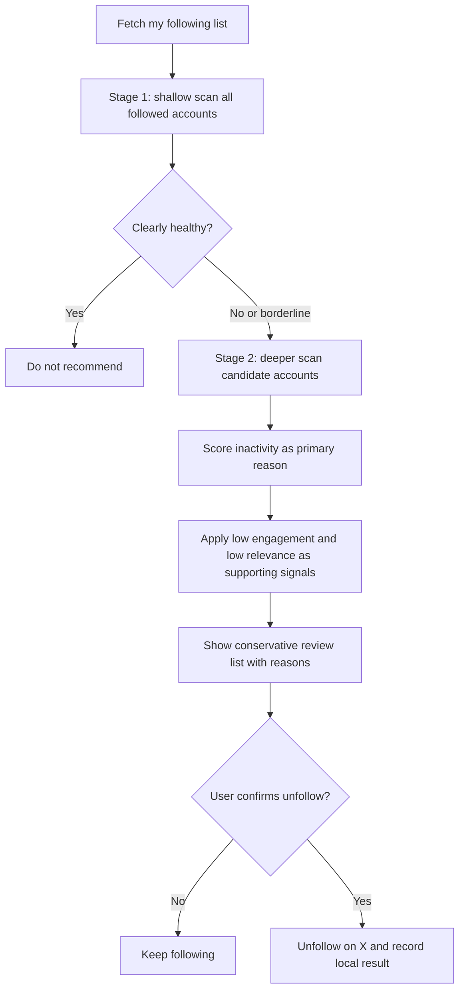

# Account Review and Unfollow

## Problem Frame

The repo can already sync individual public account timelines, but it does not help the user answer a higher-value maintenance question: which followed accounts are no longer worth following. The user wants a CLI flow that reviews the accounts they currently follow on X, identifies conservative unfollow candidates, explains why they were flagged, and lets the user confirm remote unfollow actions.

The lead reason for recommendation should be inactivity. Low engagement and low relevance should strengthen the case, but not dominate it. Relevance in v1 should come from manual labels rather than inferred taste alone, so the system can become more useful without pretending to know the user's preferences before it has feedback.

## Requirements

**Following Review Scope**
- R1. The system reviews accounts from the user's current X following list, not only accounts already synced locally.
- R2. The review flow must be CLI-first and produce a ranked review list of conservative unfollow candidates rather than automatically unfollowing accounts.
- R3. Each candidate must include an explainable primary reason, with `inactive` as the primary reason in v1 when an account is recommended.

**Scoring and Evidence**
- R4. Candidate scoring must combine three dimensions: inactivity, low engagement, and low relevance.
- R5. Inactivity must be the strongest scoring dimension and should reflect lack of posting over a configurable recent period.
- R6. Low engagement should use signals available from the account and its recent posts, including follower size and recent post engagement such as likes, replies, and views when available.
- R7. Low relevance in v1 should be based on manual user labels or feedback rather than only inferred topic similarity.
- R8. The recommendation list should be conservative by default, showing only accounts with strong enough evidence across the defined dimensions.

**Review and Action Flow**
- R9. The system must use a two-stage review pipeline: a shallow scan across the full following list, then a deeper scan only for borderline or suspicious accounts before final recommendation.
- R10. The review output must show the evidence behind each recommendation, including the inactivity window and any supporting engagement or relevance signals that contributed materially.
- R11. Unfollow actions must require explicit user confirmation from the review list; no automatic bulk unfollowing in v1.
- R12. After a confirmed unfollow, the CLI must report which account was unfollowed and whether local state reflects that result.

**Learning and Local State**
- R13. The system must retain enough local state to avoid rebuilding the full review context from scratch on every run.
- R14. Manual relevance labels provided by the user must be stored locally and reused in future review runs.
- R15. The product must preserve a future path to repeated account maintenance workflows without requiring that v1 solve full automation, notifications, or autonomous pruning.

## Success Criteria
- The user can run one CLI workflow that reviews their current following list and returns a conservative, explainable set of unfollow candidates.
- The user can understand why an account was flagged, with inactivity clearly leading the explanation when relevant.
- The user can confirm an unfollow from the CLI and have the action executed on X without needing to leave the tool.
- The user can provide manual relevance feedback and see later reviews reflect that feedback.

## Scope Boundaries
- No automatic unfollowing without an explicit review-and-confirm step in v1.
- No requirement that v1 infer user relevance from embeddings, bookmarks, or feed history alone.
- No requirement that all followed accounts receive deep timeline sync on every run; only candidate accounts should receive deeper inspection.
- No notifications, scheduled autonomous cleanup, or background pruning decisions in v1.
- No requirement to expose this workflow in the web UI in v1.

## Key Decisions
- Review the full following list first: the user wants unfollow recommendations across all followed accounts, not just manually tracked accounts.
- Use a two-stage scan: this keeps the workflow broad enough to be useful without paying the cost of a deep sync for every followed account.
- Make inactivity the primary explanation: this gives recommendations a clear, defensible lead reason instead of an opaque blended score.
- Keep low engagement and low relevance as supporting signals: they make recommendations smarter without obscuring the main rationale.
- Use manual labels for relevance in v1: this is the most credible first version of "valuable to me" and avoids pretending that current archives fully capture the user's taste.
- Require confirmation before unfollow: remote follow-state changes are destructive enough that the product should default to operator review.
- Tune recommendations conservatively: false positives are more damaging than leaving some weak accounts untouched.

## Dependencies / Assumptions
- The tool can obtain the user's current following list from X using an auth model that fits the repo's existing browser-session-first approach.
- The tool can perform remote unfollow actions through the same general X integration style already used for bookmark and like mutations.
- Enough post and account metadata can be fetched to support inactivity and engagement evaluation for candidate accounts.

## Outstanding Questions

### Deferred to Planning
- [Affects R1][Technical] What is the best browser-session-based path for fetching the full following list while keeping the CLI resilient to X contract drift?
- [Affects R11][Technical] What X web mutation path should be used for unfollow, and what confirmation and recovery behavior should mirror the existing destructive actions?
- [Affects R5][Needs research] What default inactivity window is strict enough to be useful without over-flagging sporadically active but still valuable accounts?
- [Affects R6][Needs research] Which engagement thresholds should be absolute versus relative to follower size so low-volume niche accounts are not unfairly penalized?
- [Affects R14][Technical] What is the smallest durable local label model that supports manual relevance feedback without over-designing a broader preference system?

## Next Steps
→ /prompts:ce-plan for structured implementation planning
