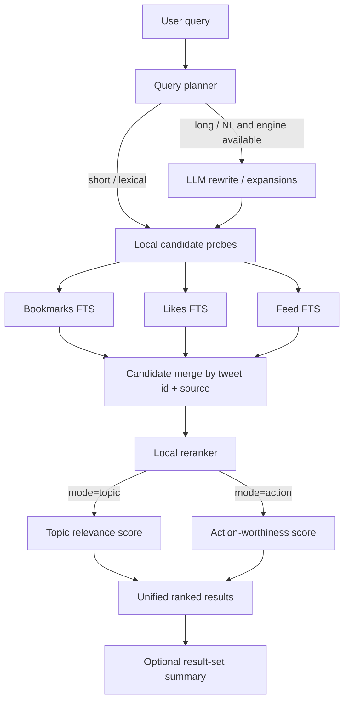

# feat: Add hybrid cross-archive search

## Overview

Add one hybrid search capability across feed, likes, and bookmarks, exposed through both CLI and web. The first release should return concrete mixed-source results, default to topic relevance, preserve a switchable action-worthiness mode, and optionally produce a result-set summary.

## Problem Frame

The repo can already sync and browse bookmarks, likes, and feed items locally, but retrieval is fragmented and mostly lexical. The user wants to search by topic, including longer natural-language prompts like "best practices on claude code", and get relevant posts even when exact word overlap is incomplete. The feature must search one mixed local corpus instead of forcing the user to think in separate archive buckets, while preserving a future path for ranking by "would I likely like or bookmark this?" rather than only "does this text match?" (see origin: `docs/brainstorms/2026-04-14-feed-hybrid-search-requirements.md`)

## Requirements Trace

- R1. Support topic-related search beyond exact keyword matching.
- R2. Accept short keyword queries and longer natural-language queries.
- R3. Default ranking mode is topic relevance.
- R4. Preserve explicit action-worthiness ranking as a second mode.
- R9. Use hybrid retrieval rather than FTS-only ranking.
- R10. Keep local indexed retrieval as the default path, with model assistance only when warranted.
- R13. Search across feed, likes, and bookmarks in one capability.
- R15. Clearly label which archive each hit came from.
- R16. Support both CLI and web in the first release.
- R18. Return concrete result items first.
- R19. Support an optional summary of the result set.

## Scope Boundaries

- No autonomous like/bookmark actions in this feature.
- No external vector database or hosted search service.
- No attempt to replace archive-specific list/show flows.
- No production-grade recommendation explanation system in this release.
- No semantic ingest-time embeddings pipeline in this release.

## Context & Research

### Relevant Code and Patterns

- `src/bookmarks-db.ts` and `src/likes-db.ts` already use SQLite + FTS5 and expose both `search*` and `list*` read models.
- `src/feed-db.ts` already owns the feed SQLite index and list/show read models, but does not yet expose FTS search.
- `src/cli.ts` already follows a stable pattern for archive-specific command families and human-readable result formatting.
- `src/web-server.ts` already serves Hono JSON endpoints for bookmarks and likes, with `tests/web-api.test.ts` covering the contract through `app.request(...)`.
- `src/engine.ts` and `src/md-ask.ts` already establish the repo pattern for optional local LLM assistance via installed `claude` or `codex` CLIs.
- `web/src/App.tsx`, `web/src/api.ts`, and `web/src/components/*` already implement a lightweight React frontend against the Hono API.

### Institutional Learnings

- `tasks/todo.md` shows the recent repo pattern: plan-backed implementation, targeted tests, real verification, then review and docs sync.
- `AGENTS.md` in repo root requires PRs against `Decolo/fieldtheory-cli`, not upstream, unless explicitly requested.

### External References

- None. The repo already has strong local patterns for SQLite indexing, Hono APIs, and local engine invocation. The chosen first-release architecture avoids introducing a new external storage or model-serving dependency.

## Key Technical Decisions

- Hybrid architecture: use FTS candidate retrieval plus local reranking, not FTS-only and not ingest-time embeddings.
  Rationale: this satisfies the semantic retrieval goal without adding new storage infrastructure or background indexing pipelines.
- Model assistance is query-time only and optional.
  Rationale: long natural-language queries benefit from rewrite/expansion, but short exact-ish queries should remain fully local and deterministic.
- Feed must gain FTS support before unified search can exist.
  Rationale: bookmarks and likes already have candidate retrieval primitives; feed currently does not.
- Cross-archive results should return one unified ranked list.
  Rationale: the user wants one coherent capability, while per-hit source badges preserve provenance.
- Action-worthiness mode should initially use local preference signals only.
  Rationale: the requirements explicitly ground the first proxy in historical likes and bookmarks; no model training is needed for v1.
- Optional summary should synthesize the returned result set, not replace it.
  Rationale: this satisfies R18 and R19 without turning search into a chat-only surface.

## Open Questions

### Resolved During Planning

- What hybrid retrieval architecture fits this repo?
  Resolution: query-time hybrid search using FTS candidate generation plus local reranking and optional LLM rewrite/summary.
- When should model assistance run?
  Resolution: only when the query is natural-language-heavy or long enough that exact-token retrieval is likely weak, and only if a supported engine is available.
- Unified list or per-archive sections?
  Resolution: one ranked list with explicit `source` labeling and per-source metadata.
- How should mixed-source results be normalized?
  Resolution: introduce a shared search result shape for feed, likes, and bookmarks with consistent scoring, labels, and optional preference signals.
- What summary behavior is useful enough to ship?
  Resolution: an explicit summary mode that summarizes the current result set; it is additive and never replaces the ranked list.

### Deferred to Implementation

- Exact scoring weights for lexical score, phrase overlap, recency, source-presence, and action-worthiness boosts.
  Why deferred: the code will reveal the cleanest normalization points once the unified search service is wired.
- Exact query-length heuristic for invoking LLM rewrite.
  Why deferred: this should be implemented as a small, test-backed predicate after wiring the CLI and API inputs.
- Final CLI naming ergonomics for summary output formatting.
  Why deferred: the command shape is decided here, but final text formatting should follow the existing CLI help style once implemented.

## High-Level Technical Design

> *This illustrates the intended approach and is directional guidance for review, not implementation specification. The implementing agent should treat it as context, not code to reproduce.*

## Implementation Units

- [ ] **Unit 1: Add feed retrieval parity and unified search result types**

**Goal:** Give feed the same indexed search capability as bookmarks and likes, then define the shared result model needed for cross-archive retrieval.

**Requirements:** R9, R13, R15, R17

**Dependencies:** None

**Files:**
- Modify: `src/feed-db.ts`
- Modify: `src/types.ts`
- Create: `src/search-types.ts`
- Test: `tests/feed-db.test.ts`

**Approach:**
- Extend the feed SQLite schema with an FTS5 virtual table and rebuild path, mirroring the existing bookmarks/likes indexing pattern.
- Add a `searchFeed()` read model that returns the same core fields used by bookmarks and likes search.
- Introduce a shared normalized result shape for mixed-source search so downstream ranking and presentation do not need archive-specific branching.

**Execution note:** Implement new feed retrieval behavior test-first.

**Patterns to follow:**
- `src/likes-db.ts`
- `src/bookmarks-db.ts`

**Test scenarios:**
- Happy path: rebuilding the feed index creates FTS-backed searchability and returns a matching feed item for a topic query.
- Edge case: feed search on an existing index with zero matching rows returns an empty array without throwing.
- Error path: malformed FTS syntax produces the same user-facing invalid-query behavior style already used by archive search.
- Integration: a feed JSONL fixture rebuilt into SQLite is searchable through the public `searchFeed()` API without direct table inspection.

**Verification:**
- Feed fixtures can be indexed and queried through the new public search function with deterministic results.

- [ ] **Unit 2: Build the hybrid cross-archive search service**

**Goal:** Create one query planner, candidate merger, reranker, and optional summary pipeline across feed, likes, and bookmarks.

**Requirements:** R1, R2, R3, R4, R5, R6, R7, R8, R10, R11, R12, R14, R18, R19

**Dependencies:** Unit 1

**Files:**
- Create: `src/hybrid-search.ts`
- Create: `src/hybrid-search-prompt.ts`
- Modify: `src/engine.ts`
- Test: `tests/hybrid-search.test.ts`

**Approach:**
- Add a hybrid search service that:
  - plans candidate probes from the raw query,
  - optionally asks the installed local engine for compact rewrite/expansion terms when the query looks natural-language-heavy,
  - retrieves candidates from each archive locally,
  - merges duplicate tweet ids across archives,
  - computes normalized per-result scores for `topic` and `action`,
  - optionally generates a result-set summary from the returned hits.
- Action-worthiness v1 should derive preference signals from local likes/bookmarks presence and lightweight historical author/domain/category priors where available.
- Keep summary generation explicit and separate from result retrieval so the list-first experience remains the default.

**Execution note:** Start with a failing integration-style test around the public hybrid search API before tuning helpers.

**Patterns to follow:**
- `src/md-ask.ts`
- `src/engine.ts`

**Test scenarios:**
- Happy path: a short topical query returns a mixed-source ranked list with source labels and scores.
- Happy path: a long natural-language query uses the public hybrid API and still returns relevant local hits even when the literal phrasing differs from stored text.
- Edge case: the same tweet present in multiple archives merges into one result with combined source metadata.
- Edge case: when no engine is available, hybrid search still runs locally and returns lexical candidates.
- Error path: invalid archive-level FTS probes are surfaced as user-meaningful errors instead of silent partial failure.
- Integration: `mode=topic` and `mode=action` produce the same candidate pool but different ranking order when likes/bookmarks preference signals exist.
- Integration: summary generation consumes the already-ranked results and returns additive summary text without mutating the result list.

**Verification:**
- The public hybrid search service can be invoked from tests with fixture data and produces stable mixed-source output for both ranking modes.

- [ ] **Unit 3: Expose hybrid search through CLI and web API**

**Goal:** Add agent-friendly CLI entry points and Hono API routes for mixed-source search and optional summaries.

**Requirements:** R3, R8, R13, R15, R16, R17, R18, R19

**Dependencies:** Unit 2

**Files:**
- Modify: `src/cli.ts`
- Modify: `src/web-server.ts`
- Modify: `src/web-types.ts`
- Test: `tests/cli.test.ts`
- Test: `tests/web-api.test.ts`

**Approach:**
- Add a dedicated CLI surface for hybrid search rather than silently changing the meaning of the existing bookmarks-only `ft search`.
- Expose options for ranking mode, archive scope, result limits, and optional summary output.
- Add Hono endpoints for:
  - searching the mixed corpus,
  - requesting an optional result summary,
  - returning source-normalized result items for the web app.
- Keep the response contract explicit so CLI and web share the same core behavior but can render differently.

**Technical design:** *(directional guidance)* Use one public search service entry point from both the CLI action handlers and the Hono route handlers so scoring logic cannot drift between surfaces.

**Patterns to follow:**
- `src/cli.ts`
- `src/web-server.ts`
- `tests/web-api.test.ts`

**Test scenarios:**
- Happy path: the CLI hybrid search command prints mixed-source results with source labels and stable ordering.
- Happy path: the CLI summary option prints summary text after the ranked result list rather than instead of it.
- Edge case: limiting scope to one archive still routes through the unified search service and returns only that source.
- Error path: invalid mode values or invalid query input fail fast with CLI/helpful API errors.
- Integration: the Hono search endpoint returns the same normalized source and score fields that the CLI relies on.
- Integration: the Hono summary endpoint summarizes the current result set for the same query/mode inputs.

**Verification:**
- CLI and web API tests prove that both surfaces hit the same hybrid search behavior and preserve list-first semantics.

- [ ] **Unit 4: Add the web search experience and sync docs**

**Goal:** Surface hybrid search in the local React app, keep the existing archive viewer useful, and update project docs for the new capability.

**Requirements:** R15, R16, R17, R18, R19

**Dependencies:** Unit 3

**Files:**
- Modify: `web/src/App.tsx`
- Modify: `web/src/api.ts`
- Modify: `web/src/types.ts`
- Modify: `web/src/components/archive-layout.tsx`
- Modify: `web/src/components/detail-pane.tsx`
- Modify: `web/src/components/item-list.tsx`
- Modify: `web/src/styles.css`
- Modify: `README.md`
- Modify: `docs/README.md`
- Test: `tests/cli-web.test.ts`

**Approach:**
- Add a search-first web flow that can display mixed-source results with source badges, ranking-mode toggle, and optional summary affordance.
- Preserve the existing archive-specific browsing affordance instead of replacing it outright.
- Update README and docs index so the new CLI/API/web surfaces are discoverable and the new plan is linked from `docs/README.md`.

**Execution note:** Verify the web UX with the running local server after tests pass.

**Patterns to follow:**
- `web/src/App.tsx`
- `web/src/components/archive-layout.tsx`
- `README.md`

**Test scenarios:**
- Happy path: the web client can request mixed-source search results and render source-labeled items.
- Happy path: changing ranking mode triggers a new search request and updates the rendered list.
- Edge case: empty results show a deliberate empty state rather than a broken detail pane.
- Error path: API failures surface a readable error without crashing the app.
- Integration: the shipped web build still serves through `ft web` after the new search-first UI is added.
- Test expectation: none -- visual polish itself is covered by manual browser verification after the build; the automated proof here is API/client contract and server startup.

**Verification:**
- `ft web` serves the updated app, search works against local fixture data, and docs describe how to use it.

## System-Wide Impact

- **Interaction graph:** search now spans three previously separate archive indices plus optional engine invocation for rewrite/summary.
- **Error propagation:** archive retrieval failures and engine failures must degrade predictably; search should remain usable locally when the engine path is unavailable.
- **State lifecycle risks:** feed index schema changes must remain rebuild-safe because the canonical source is still JSONL; no new persistent source-of-truth is introduced.
- **API surface parity:** the same hybrid service must back CLI and web so ranking semantics do not drift.
- **Integration coverage:** cross-archive dedupe, source labeling, and summary generation need end-to-end tests through the public APIs.
- **Unchanged invariants:** existing `ft search`, `ft list`, `ft likes search`, `ft feed list`, and archive-specific show flows remain intact.

## Risks & Dependencies

| Risk | Mitigation |
|------|------------|
| Hybrid ranking feels too lexical for long natural-language prompts | Use query-time LLM expansion when helpful and verify with fixture queries that differ from stored wording |
| Engine availability differs per machine | Make the engine path optional and keep fully local retrieval as the default fallback |
| Feed FTS schema change causes stale local index behavior | Rebuild-safe schema initialization and fixture tests around fresh and existing indexes |
| Web and CLI diverge in contract or field naming | Route both surfaces through one shared hybrid search service and normalized response types |
| Action-worthiness mode overfits to sparse signals | Keep the initial signal set narrow and documented as a heuristic, not a predictive model claim |

## Documentation / Operational Notes

- Update `README.md` with the new hybrid search CLI usage and web workflow.
- Update `docs/README.md` with the new brainstorm and plan entries.
- Preserve the repo rule that PRs target `Decolo/fieldtheory-cli`.

## Sources & References

- **Origin document:** `docs/brainstorms/2026-04-14-feed-hybrid-search-requirements.md`
- Related code: `src/bookmarks-db.ts`
- Related code: `src/likes-db.ts`
- Related code: `src/feed-db.ts`
- Related code: `src/web-server.ts`
- Related code: `web/src/App.tsx`
