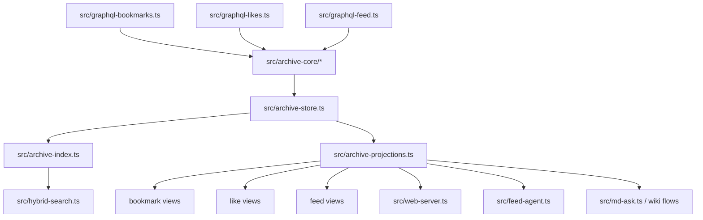

# Unified Archive Foundation Plan

## Problem Frame

This repository has already evolved beyond the original bookmark-and-wiki product. It now has three tweet-shaped archive families (`bookmarks`, `likes`, `feed`) plus feed automation, semantic retrieval, daemon workflows, and a web dashboard. The current technical issue is not missing capability; it is that these capabilities sit on top of three partially parallel ingestion and storage stacks.

The objective is to establish one shared archive foundation that can power assistant memory, search, automation, web views, and knowledge workflows while retaining source-specific behavior where it still matters (see origin: `docs/brainstorms/2026-04-17-x-assistant-unified-archive-requirements.md`).

## Planning Context

Local research shows the repository already has a near-shared item shape in `src/types.ts`, but persists and queries it through separate modules: `src/graphql-bookmarks.ts`, `src/graphql-likes.ts`, `src/graphql-feed.ts`, `src/bookmarks-db.ts`, `src/likes-db.ts`, `src/feed-db.ts`, and a web layer that still exposes mixed abstractions in `src/web-types.ts` and `src/web-server.ts`. `src/hybrid-search.ts` already performs a soft union across the three stores, which is a strong signal that the product wants one archive view even though the persistence layer does not yet provide it.

The codebase has enough local pattern coverage that external research is unnecessary for this plan. The main challenge is sequencing and compatibility, not unknown framework behavior.

## Requirements Trace

- R1-R3: Make the fork independent from upstream sync pressure and orient future work around the unified archive.
- R4-R7: Introduce one canonical local archive model with shared content and source-specific metadata.
- R8-R11: Move CLI, web, search, assistant, and knowledge workflows toward one contract without dropping current source-scoped experiences.
- R12-R15: Execute incrementally, preserve data, and identify which legacy bookmark-derived areas should be wrapped, frozen, or retired.

## Scope Boundaries

### In Scope
- Introduce a canonical archive-core layer for shared item shape and source attachments
- Define phased migration of sync, index, search, web, and automation surfaces
- Preserve feed-agent and daemon behavior while moving them onto the new foundation
- Establish compatibility strategy for legacy bookmark-era commands

### Out of Scope
- A flag day rewrite of all commands or the entire wiki toolchain
- A new remote backend or cloud storage model
- Full command taxonomy cleanup in the same phase as storage unification
- Automatic ingestion of upstream changes

## Key Technical Decisions

- Canonical item plus source attachments is the target model.
  Rationale: `BookmarkRecord`, `LikeRecord`, and `FeedRecord` already overlap heavily; the duplication is in persistence and orchestration, not in the tweet payload.

- Start at the storage and service layer, not the CLI layer.
  Rationale: CLI unification before shared persistence would create a façade over duplicate internals and increase carrying cost.

- Rebuild from existing JSONL caches first; defer direct SQLite migration unless it proves cheaper.
  Rationale: Current JSONL caches are the most stable shared input across the three source families. Re-deriving new indexes from them is lower risk than mutating three existing SQLite layouts in place.

- Preserve source-specific projections during migration.
  Rationale: bookmarks, likes, and feed still need different list sorting, timestamps, and action semantics even after the content foundation is shared.

- Keep feed automation as a first-class consumer of the new core.
  Rationale: feed agent, preferences, daemon state, and metrics are the strongest expression of the product's new direction and should shape the architecture instead of being retrofitted after the fact.

## Target Architecture

## Migration Strategy

1. Establish a canonical shared item contract and persistence boundary.
2. Route new ingestion results into the shared foundation while preserving legacy outputs.
3. Move read paths to projection builders backed by the shared foundation.
4. Move write-side archive reconciliation and compatibility wrappers onto the same core.
5. Freeze or retire legacy bookmark-era modules once shared flows cover the active product surface.

## Implementation Units

### Unit 1: Archive Core Types and Boundaries

**Goal**
- Introduce a canonical archive item model and source attachment model without breaking existing call sites.

**Files**
- Add `src/archive-core.ts` or `src/archive-core/`
- Update `src/types.ts`
- Update `src/paths.ts`

**Changes**
- Define a canonical item shape for shared tweet content, author snapshot, media, links, engagement, and normalized text.
- Define source attachment metadata for bookmark, like, and feed facts such as source name, source-local timestamp, ordering key, fetch position, and ingest mode.
- Add shared path helpers and naming for a future unified cache/index pair while leaving existing cache paths intact during transition.
- Mark current record types as compatibility projections over the canonical model rather than the long-term source of truth.

**Pattern References**
- `src/types.ts`
- `src/paths.ts`

**Test Files**
- Add `tests/archive-core.test.ts`
- Update `tests/cli-feed.test.ts`
- Update `tests/cli-likes.test.ts`
- Update `tests/bookmarks.test.ts`

**Test Scenarios**
- Canonical item can represent bookmark-only, like-only, feed-only, and multi-source records.
- Source attachment metadata preserves source-specific ordering and timestamps.
- Compatibility projection back to existing record shapes remains lossless for current consumers.

### Unit 2: Unified Store and Rebuild Pipeline

**Goal**
- Create one storage entry point that can rebuild shared persistence from current JSONL caches.

**Files**
- Add `src/archive-store.ts`
- Add `src/archive-index.ts`
- Update `src/db.ts`
- Update `src/archive-actions.ts`

**Changes**
- Introduce a unified store responsible for loading canonical items, upserting source attachments, and rebuilding derived indexes.
- Use rebuild-from-cache as the first migration posture instead of mutating current per-source SQLite schemas in place.
- Move archive upsert and removal helpers toward shared primitives so bookmark and likes stop having bespoke reconciliation code.

**Pattern References**
- `src/archive-actions.ts`
- `src/bookmarks-db.ts`
- `src/likes-db.ts`
- `src/feed-db.ts`

**Test Files**
- Add `tests/archive-store.test.ts`
- Add `tests/archive-index.test.ts`
- Update `tests/archive-actions.test.ts`

**Test Scenarios**
- Unified rebuild from existing bookmark, likes, and feed caches produces one canonical store.
- Re-running rebuild is idempotent.
- Removing a source attachment updates derived totals without corrupting the shared item.
- Multi-source items survive partial source removal correctly.

### Unit 3: Ingestion Adapters

**Goal**
- Convert sync pipelines into adapters that emit canonical items plus source attachments.

**Files**
- Update `src/graphql-bookmarks.ts`
- Update `src/graphql-likes.ts`
- Update `src/graphql-feed.ts`
- Update `src/bookmarks.ts`

**Changes**
- Split current converter functions into two layers:
  - X-contract parsing
  - canonical archive emission
- Keep source-specific sync behavior and stop conditions, but route normalized output through the shared archive store.
- Preserve bookmark GraphQL/API dual-path capability and feed-specific fetch metadata.

**Pattern References**
- `src/graphql-bookmarks.ts`
- `src/graphql-likes.ts`
- `src/graphql-feed.ts`

**Test Files**
- Update `tests/graphql-bookmarks.test.ts`
- Update `tests/graphql-likes.test.ts`
- Update `tests/graphql-feed.test.ts`

**Test Scenarios**
- Each ingestion adapter emits the expected canonical item payload.
- Long-form text, quoted tweets, links, media, and engagement survive normalization.
- A tweet seen first in feed and later in likes/bookmarks merges into one canonical item with multiple attachments.

### Unit 4: Projection Builders for Source-Scoped Reads

**Goal**
- Make existing bookmark, likes, and feed read experiences projections over the unified store.

**Files**
- Add `src/archive-projections.ts`
- Update `src/bookmarks-db.ts`
- Update `src/likes-db.ts`
- Update `src/feed-db.ts`
- Update `src/bookmarks-service.ts`
- Update `src/likes-service.ts`
- Update `src/feed-service.ts`

**Changes**
- Introduce projection builders that derive bookmark, like, and feed timeline rows from the shared store.
- Keep current public function signatures where practical so CLI and web changes can land later.
- Reduce duplicate SQL/schema logic by centralizing shared ranking fields and shared item hydration.

**Pattern References**
- `src/bookmarks-db.ts`
- `src/likes-db.ts`
- `src/feed-db.ts`
- `src/hybrid-search.ts`

**Test Files**
- Update `tests/bookmarks-db.test.ts`
- Update `tests/likes-db.test.ts`
- Update `tests/feed-db.test.ts`
- Update `tests/bookmarks-service.test.ts`
- Update `tests/likes-service.test.ts`
- Update `tests/feed-service.test.ts`

**Test Scenarios**
- Existing source-scoped list/show/status flows return equivalent results after projection migration.
- Source-specific sort order remains correct for bookmarks, likes, and feed.
- Projection builders exclude or include items correctly when one item has multiple sources.

### Unit 5: Search, Web, and Assistant Consumers

**Goal**
- Move mixed-source consumers onto the shared foundation first, because they benefit most from unification.

**Files**
- Update `src/hybrid-search.ts`
- Update `src/search-types.ts`
- Update `src/web-types.ts`
- Update `src/web-server.ts`
- Update `web/src/types.ts`
- Update `web/src/api.ts`
- Update `web/src/App.tsx`
- Update `src/md-ask.ts`
- Update `src/semantic-indexer.ts`

**Changes**
- Replace soft union across three stores with direct queries against the unified archive and source attachments.
- Expand web API contracts so "archive" is the first-class concept and bookmarks/likes/feed are source filters, not unrelated resource families.
- Keep source-scoped UI affordances, but base them on one underlying model.
- Point semantic indexing and assistant retrieval at canonical items to eliminate per-source duplication.

**Pattern References**
- `src/hybrid-search.ts`
- `src/web-server.ts`
- `src/feed-metrics.ts`

**Test Files**
- Update `tests/hybrid-search.test.ts`
- Update `tests/web-api.test.ts`
- Update `tests/cli-web.test.ts`

**Test Scenarios**
- Search returns the same or better merged-source behavior with fewer duplicate items.
- Web archive views can filter by source while reading from one contract.
- Semantic coverage and assistant retrieval do not double-count the same tweet across multiple source families.

### Unit 6: Feed Automation and Compatibility Wrappers

**Goal**
- Keep automation stable while legacy command surfaces are gradually wrapped around the new core.

**Files**
- Update `src/feed-agent.ts`
- Update `src/feed-consumer.ts`
- Update `src/feed-daemon.ts`
- Update `src/feed-preferences.ts`
- Update `src/cli.ts`
- Update `README.md`
- Update `AGENTS.md`

**Changes**
- Make feed agent candidate selection and action idempotency read from the canonical archive plus source attachments.
- Preserve existing daemon state, logs, and preference semantics.
- Introduce compatibility wrappers in `src/cli.ts` where commands still expose source-specific names over unified internals.
- Document the repository's independence from upstream sync and the new archive-centered product narrative.

**Pattern References**
- `src/feed-agent.ts`
- `src/feed-daemon.ts`
- `src/cli.ts`

**Test Files**
- Update `tests/feed-agent.test.ts`
- Update `tests/feed-daemon.test.ts`
- Update `tests/cli-feed-agent.test.ts`
- Update `tests/cli-actions.test.ts`
- Update `tests/cli.test.ts`

**Test Scenarios**
- Feed agent decisions remain stable when items also exist as bookmarks or likes.
- Daemon logs and status still describe real collection and consume behavior after the storage migration.
- CLI compatibility commands continue to work while internally routing through the new archive foundation.

## Legacy Freeze / Removal Candidates

### Freeze Behind Adapters First
- `src/bookmarks.ts`
- bookmark-specific service formatting in `src/bookmarks-service.ts`
- legacy archive reconciliation in `src/archive-actions.ts`

### Actively Refactor Into the New Core
- `src/types.ts`
- `src/graphql-bookmarks.ts`
- `src/graphql-likes.ts`
- `src/graphql-feed.ts`
- `src/hybrid-search.ts`
- `src/web-server.ts`
- `src/feed-agent.ts`

### Defer Any Retirement Decision
- `src/md.ts`
- `src/md-export.ts`
- `src/md-ask.ts`
- `src/bookmark-classify.ts`
- `src/bookmark-classify-llm.ts`

Rationale: these remain product-relevant, but their eventual role depends on whether knowledge workflows expand from bookmark-only to archive-wide synthesis.

## Risks and Mitigations

- Risk: multi-source merge logic silently drops source-specific facts.
  Mitigation: characterization tests around canonical-to-legacy projection and explicit attachment preservation.

- Risk: migration touches feed automation and causes behavioral regression.
  Mitigation: keep feed agent and daemon as a dedicated implementation unit with stable black-box test coverage.

- Risk: rebuilding from caches leaves some older local data unrepresented.
  Mitigation: add rebuild audits and compare per-source counts before switching default read paths.

- Risk: CLI cleanup scope expands into a naming redesign project.
  Mitigation: treat command taxonomy cleanup as follow-on work; current plan only wraps and stabilizes behavior.

## Recommended Execution Posture

Characterization-first. The affected code is cross-cutting and partially legacy-derived. Before any broad refactor, implementation should lock down current bookmark, likes, feed, search, and feed-agent behavior with targeted characterization coverage around the seams that will move.

## Sequencing

1. Unit 1: archive core types and compatibility projections
2. Unit 2: unified store and rebuild pipeline
3. Unit 3: ingestion adapters
4. Unit 4: source-scoped projection builders
5. Unit 5: search, web, semantic, and assistant consumers
6. Unit 6: feed automation stabilization and CLI/documentation wrappers

## Open Questions

- Should the unified store become the only persisted SQLite database immediately, or should a short-lived dual-write phase exist while read paths migrate?
- Should `ft search`, `ft likes search`, and `ft feed list` remain permanent user-facing concepts, or become thin compatibility aliases over a future archive-first CLI taxonomy?
- When knowledge workflows expand beyond bookmarks, is the right unit of synthesis the canonical item set, or source-filtered subsets chosen at query time?

## Implementation Readiness

This plan is ready for execution because it:
- preserves the product decisions from the origin document
- identifies the smallest high-leverage technical pivot
- keeps each migration phase shippable
- names the files and tests an implementer should touch
- separates long-term architecture from immediate compatibility obligations
